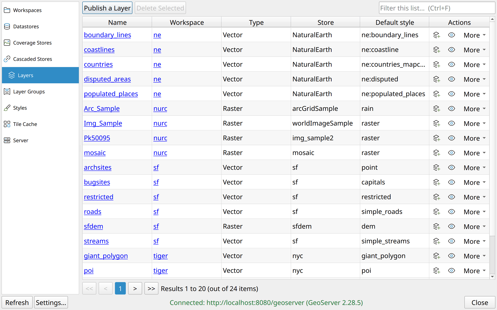

<div align="center">

<picture>
  <source media="(prefers-color-scheme: dark)" srcset="docs/static/branding/wordmark-white.png">
  
</picture>

<p><strong>GeoServer, inside QGIS.</strong></p>

<p>
  <a href="https://qgis.org"></a>
  <a href="https://geoserver.org"></a>
  <a href="https://github.com/camptocamp/python-geoservercloud"></a>
  <a href="LICENSE"></a>
</p>



</div>

Manage a GeoServer from inside QGIS. Browse, create, edit and delete
workspaces, datastores, coverage stores, cascaded WMS/WMTS stores, layers, layer
groups, styles, the tile cache and the server's own settings; publish a table, or a vector or raster layer of the open
project; bring what the server has back into QGIS as WMS, WFS or WMTS, without
switching to the GeoServer web admin.

Built on [`python-geoservercloud`](https://github.com/camptocamp/python-geoservercloud):
missing library operations and plugin workarounds are tracked in
[issue #1](https://github.com/ronitjadhav/qgis-geoserver-manager/issues/1).

> **Status:** experimental, not yet released. Developed against GeoServer 2.28.

## Features

| Tab | What you can do |
| :-- | :-------------- |
| Workspaces | list (the default workspace is marked), create, rename, change the namespace URI, toggle isolation, set as default, give the workspace its own WMS, WFS, WCS and WMTS settings (on or off, title, abstract, keywords, …), delete |
| Datastores | list across every workspace; create PostGIS, PostGIS (JNDI), Shapefile, directory of shapefiles, GeoPackage, PMTiles or Web Feature Server (NG) stores (a remote WFS cascaded), enable or disable one, or any other type through a table of its parameters; edit (only the fields you change are sent), reset, delete |
| Coverage stores | list, create from a GeoTIFF, a COG, an ArcGrid, a WorldImage or an ImageMosaic, or from a raster layer of the open QGIS project, uploaded as a compressed GeoTIFF and published in the same request; edit a store (name, URL, description, enabled), reset it; browse the coverages of a store, publish a coverage as a layer, delete |
| Cascaded stores | the WMS and WMTS stores that proxy another server, listed across every workspace; create one from a GetCapabilities URL, with credentials when the remote asks for them; edit it (URL, credentials, connections, timeouts, enabled); publish the layers the remote advertises, inspect and delete them, delete the store |
| Layers | every layer of the server whatever its type (vector, raster, cascaded WMS/WMTS) with workspace, type, store and default style; publish a table of a datastore, or a layer of the open QGIS project, uploaded as a GeoPackage (a vector) or a GeoTIFF (a raster) together with its symbology; edit a layer (name, title, abstract, keywords, SRS, projection policy, CQL filter, enabled, advertised), update it from the data; change the default and the other styles, including one made from a QGIS layer's symbology; add to QGIS as WMS, WMTS or, for a vector, WFS; preview on a map inside QGIS with feature info on click, or in a browser on GeoServer's own OpenLayers page; delete |
| Layer groups | list global and workspace groups; create and edit them (ordered layers and nested groups with their styles, mode, title, enabled, advertised, an Earth Observation root layer), with their bounds recomputed; add to QGIS, preview on a map inside QGIS or in a browser, delete |
| Styles | list global and workspace styles; create by pasting SLD, CSS, YSLD or MBStyle, from a file, or from a QGIS layer's symbology; view and edit the definition next to the legend GeoServer renders for it; rename, copy, see what uses a style; apply it to a QGIS layer (any format); save it to disk; delete |
| Tile cache | what GeoWebCache caches (every layer and layer group, by default) with each layer's gridsets and formats; edit a layer's caching (gridsets and their zoom levels, formats, meta-tiling, expiry, parameter filters); seed, reseed or truncate part of it and follow the tasks; truncate its tiles, remove it from the cache, add an uncached layer |
| Server | the contact details, global settings (proxy base URL, decimals, verbosity), each service's settings and capabilities URL, the logging profile and the log's last lines, the catalog's reload and reset; each opens GeoServer's own page too |
| Layer tree | right-click one or more layers in QGIS for *Publish to GeoServer…*, *Push style to GeoServer…* and *Apply style from GeoServer…*; a layer that came from the server is matched through its source, any other by name; the entries say when the plugin is not connected |

Every list is searchable (by the columns loaded so far), sortable by column and paginated (20 per page), and
loads in the background: QGIS stays usable, and *Cancel* stops a slow one.
Deletes ask first and name what they cascade to. Keyboard: F5 refreshes, Ctrl+F
jumps to the search box, Enter opens the selected row, Del deletes the
selection, Esc clears the filter. Colours follow the QGIS theme, dark ones
included; the interface is translatable and ships a partial French locale.

## Requirements

- QGIS 3.40 to 4.x, on Qt5 or Qt6
- Network access to a GeoServer REST API, with an account allowed to read and
  write the resources you want to manage
- GeoServer 2.28, the version the plugin is tested with (2.28.5). Other
  versions and GeoServer Cloud are not tested as a whole; the
  [user guide](docs/usage/guide.md#supported-geoserver-versions) lists what is
  known to differ

`geoservercloud` and `xmltodict` ship with the plugin. QGIS's Python
environment often cannot see system site-packages, so both are bundled as
wheels in `geoserver_manager/extras/` and added to `sys.path` at startup.
`owslib` and `requests` come with QGIS.

## Installation

Until the plugin is published on <https://plugins.qgis.org>:

1. Open *Plugins → Manage and Install Plugins → Settings*.
2. Enable experimental plugins and add this repository URL:

   ```text
   https://ronitjadhav.github.io/qgis-geoserver-manager/plugins.xml
   ```

3. Find *GeoServer Manager* in the plugin manager and install it.

The feed contains development builds. See the
[installation guide](docs/usage/installation.md) for details.

For a development install, see [Development](#development) below.

## Configuration

*Settings → Options → GeoServer Manager*, or the plugin menu's *Settings* entry:

| Field | Notes |
| :---- | :---- |
| Profile | one saved connection per server (dev, staging, prod…): *Add…* and *Remove*; saving makes the shown one active |
| Base URL | e.g. `https://example.com/geoserver`, must start with `http://` or `https://` |
| Username / Password | kept as plain text in your QGIS settings by default, so QGIS never asks for its master password; tick *Keep the password in QGIS's encrypted authentication database* to store them encrypted instead (QGIS then asks for the master password once per session, unless it keeps that password in your system keyring) |
| Verify the server's TLS certificate | on by default; for a private CA, set `REQUESTS_CA_BUNDLE` rather than untick it (see [network settings](docs/usage/installation.md#a-private-certificate-authority)) |
| Test connection | probes the server with the fields as typed, without saving them |

Behind a proxy, the plugin uses the HTTP proxy of QGIS's *Options*,
*Network* tab (see [network settings](docs/usage/installation.md#behind-a-proxy)).

Debug mode can also come from the environment:
`QGIS_GEOSERVER_MANAGER_DEBUG_MODE=true` wins over the saved value, and is not
saved. The connection cannot, since a profile keeps its server and its
credentials together.

Then open the plugin from the toolbar. The status line shows the connected
server and its version; with two or more profiles, a list beside it switches
server and reloads the open tab; connection, authentication and HTTP problems are
reported in the dialog's message bar and in the QGIS log panel (*GeoServer
Manager* tab). Over plain `http://` to a remote host the password travels
unencrypted; the plugin says so once, when saving.

## Development

### Local install (symlink)

Symlink the plugin package into a QGIS profile so QGIS loads the working tree
directly: there is no build step, the bundled wheels are committed.

```sh
git clone https://github.com/ronitjadhav/qgis-geoserver-manager.git
cd qgis-geoserver-manager

# Linux
ln -s "${PWD}/geoserver_manager" "$HOME/.local/share/QGIS/QGIS3/profiles/default/python/plugins/"

# macOS
ln -s "${PWD}/geoserver_manager" "$HOME/Library/Application Support/QGIS/QGIS3/profiles/default/python/plugins/"

# Windows (PowerShell, as administrator)
New-Item -ItemType SymbolicLink `
  -Path "$env:APPDATA\QGIS\QGIS3\profiles\default\python\plugins\geoserver_manager" `
  -Target "$PWD\geoserver_manager"
```

Start QGIS, then enable *GeoServer Manager* in *Plugins → Manage and Install
Plugins → Installed*. Code changes are picked up by the
[Plugin Reloader](https://plugins.qgis.org/plugins/plugin_reloader/) plugin or a
QGIS restart.

Replace `default` with another profile name (e.g. `plg_geoserver_manager`,
started with `qgis --profile plg_geoserver_manager`) to keep development apart
from your everyday QGIS. See
[docs/development/environment.md](docs/development/environment.md) for the
virtualenv setup and the `QGIS_PLUGINPATH` alternative.

### Local GeoServer (Docker)

A throwaway server to develop against, including the PostGIS database the
plugin's main datastore type needs:

```sh
docker compose up -d      # GeoServer on :8080 (admin/geoserver) + PostGIS
docker compose ps         # wait until gsm-geoserver is "healthy"
docker compose down -v    # stop and discard the data
```

Configure the plugin with `http://localhost:8080/geoserver` and
`admin` / `geoserver`. It starts with GeoServer's demo data (8 workspaces, 24
layers); `SKIP_DEMO_DATA=true docker compose up -d` on a fresh volume gives an
empty server instead. In the datastore form, reach the database the way GeoServer
sees it: host `postgis`, port `5432`, database / user / password `geoserver`.
Details in
[docs/development/environment.md](docs/development/environment.md).

### Before changing code

Read the [architecture](docs/development/architecture.md), the
[invariants](docs/development/invariants.md) and the
[conventions](docs/development/conventions.md). They record what the code
cannot tell you, and each invariant was a real bug.

### Checks

[](https://github.com/pre-commit/pre-commit)
[](https://github.com/psf/black)
[](https://pycqa.github.io/isort/)
[](https://flake8.pycqa.org/)

```sh
python -m pip install -U -r requirements/development.txt
pre-commit install

pre-commit run -a                       # lint + format
python -m pytest tests/unit             # no QGIS needed
python -m pytest tests/qgis             # needs a QGIS Python environment
```

Contributions welcome: see [CONTRIBUTING.md](CONTRIBUTING.md) and the
[contribution guide](docs/development/contribute.md).

## Documentation

Written in Markdown under `docs/`, built with Sphinx + myst-parser and
published to <https://ronitjadhav.github.io/qgis-geoserver-manager/>.

Start with the [usage guide](docs/usage/guide.md): connecting, what each tab
does, publishing from QGIS, styles both ways, keyboard shortcuts, troubleshooting.

## License

Distributed under the terms of the [`GPLv2+` license](LICENSE).
