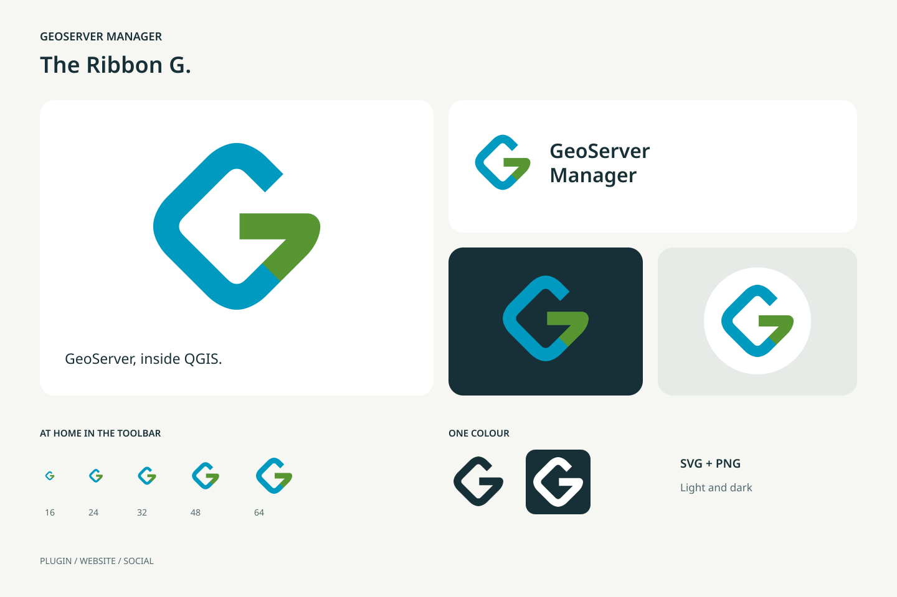

# Branding

The Ribbon G is the GeoServer Manager logo. A blue ribbon follows the outline
of a rounded map tile, then bends inward in green to form a G. The diamond and
the blue refer to GeoServer; the green connects the identity to QGIS. The open
shape works at toolbar size and in a single colour.

## Downloads

[Download the complete brand kit](static/branding/brand-kit.zip).

| Use | Files |
| :-- | :-- |
| Scalable icon | [Colour SVG](static/branding/mark.svg), [dark SVG](static/branding/mark-mono.svg), [white SVG](static/branding/mark-white.svg) |
| Transparent PNG | [16 px](static/branding/icon-16.png), [24 px](static/branding/icon-24.png), [32 px](static/branding/icon-32.png), [64 px](static/branding/icon-64.png), [128 px](static/branding/icon-128.png), [256 px](static/branding/icon-256.png), [512 px](static/branding/icon-512.png) |
| Website header | [Wordmark SVG](static/branding/wordmark.svg), [PNG](static/branding/wordmark.png), [white-text SVG](static/branding/wordmark-white.svg) |
| Browser favicon | [Multi-size ICO](static/branding/favicon.ico), [SVG](static/branding/mark.svg) |
| Social avatar, 1024 × 1024 | [Light PNG](static/branding/avatar.png), [dark PNG](static/branding/avatar-dark.png), [editable SVG](static/branding/avatar.svg) |
| Social sharing, 1200 × 630 | [PNG](static/branding/social-card.png), [editable SVG](static/branding/social-card.svg) |

The avatars leave room for a circular profile crop. The PNGs are ready to
upload. Use the SVGs for websites and for resizing. The wordmark uses DejaVu
Sans with a sans-serif fallback. The icon itself depends on no font.

## Colours and spacing

| Colour | Hex | Role |
| :-- | :-- | :-- |
| Green | `#589632` | Inward bend forming the G |
| Blue | `#0099C0` | Outer map-tile ribbon |
| Ink | `#172F36` | Text, dark background, single-colour mark |
| Paper | `#F6F7F3` | Light background |

Keep the icon square. In a standalone layout, leave clear space of at least
one eighth of its width outside the canvas. At 16 px, use the symbol alone.
Use the white version on a busy or coloured background where the full-colour
mark has too little contrast. Do not add outlines, gradients or shadows.

Visual references: [QGIS's green](https://www.qgis.org/styleguide/)
and [GeoServer's blue geographic diamond](https://geoserver.org/).
The artwork is drawn from scratch for GeoServer Manager, an independent
plugin.

## Updating the assets

The source is `geoserver_manager/resources/images/geoserver_manager.svg`.
Everything in `docs/static/branding/`, and the 256 px
`resources/images/default_icon.png` that the plugin metadata points at, is
rendered from it by the maintainer. Do not edit the exported files by hand.
Open an issue or a pull request that changes the SVG instead. The toolbar,
the menus and the settings render the SVG directly through the shared icon
renderer; the website uses the SVG and the multi-size favicon.

## Interface icons

The navigation, the row actions, the settings, the help and the layer-tree
menu share original SVG artwork. The
[icon style guide](development/icon-style-guide.md) records the thin-stroke
rules and how to register a new icon. `catalog.json` tracks the custom
artwork and the pending fallbacks. An optional gallery can be generated
locally for visual review; it is not committed or published with this site.
